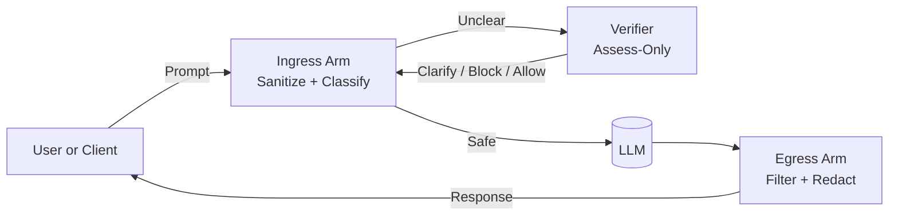

# Guardrail API — Docs Portal

Welcome to the Guardrail API umbrella documentation. This site brings together the
operational guidance, architectural background, and governance controls that underpin the
Guardrail platform. Use the navigation to explore the runtime, policy packs, verifier
workflow, and supporting assets maintained across the Guardrail repositories.

**Versions:** Core `1.5.0` • Enterprise `1.4.0` • Verifier `0.2.0` • Policy Packs `1.0.0`

## Clarify-First Architecture

The Guardrail API follows a “clarify-first, then block” philosophy. Every ambiguous or
potentially unsafe request is clarified before execution.

Ingress Arm — Normalizes text, detects confusables, and classifies safety. Unclear or
borderline requests are sent to the Verifier.

Verifier — An assess-only microservice that never executes user code; it determines whether a
request is safe, needs clarification, or should be blocked.

Egress Arm — Filters model outputs, redacts sensitive or non-compliant data, and protects users
even when ingress is degraded (dual-arm resilience).

- **What is Guardrail?** A real-time safety & compliance firewall for LLMs with clarify-first policy enforcement.
- **Components**
  - [Core Runtime](components/core.md)
  - [Enterprise Admin Console](components/enterprise.md)
  - [Verifier Microservice](components/verifier.md)
  - [Policy Packs](policy-packs/index.md)

---
