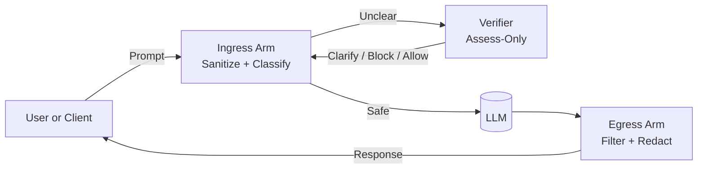

# Guardrail API — Documentation Portal

Welcome to the Guardrail API umbrella documentation. This site combines the
operational guidance, architecture, components, policy packs, verifier workflow, and
compliance materials that make up the Guardrail platform.

Use this page as your hub to navigate the full project.

---

## Versions

**Current Releases**

- **Core:** [1.6.0](components/core.md)  
- **Enterprise:** [1.5.0](components/enterprise.md)  
- **Verifier:** [0.2.0](components/verifier.md)  
- **Policy Packs:** [1.0.0](policy-packs/index.md)

> Version matrix: see `_includes/versions.md`

---

## Start Here

👉 **[Quickstart Guide](quickstart.md)**  
Run the Core runtime, create a tenant, and send your first decision request.

---

## Documentation Sections

### **Overview**
- [Architecture](architecture.md)
- [About Guardrail](about.md)
- Components:
  - [Core Runtime](components/core.md)
  - [Enterprise Admin Console](components/enterprise.md)
  - [Verifier Microservice](components/verifier.md)
  - [Policy Packs](policy-packs/index.md)

### **Core API**
- [API Reference](api-reference.md)
- [API Summary](api/summary.md)
- [Tenants & RBAC](tenants-and-rbac.md)

### **Enterprise Console**
- [Admin UI Overview](admin-ui.md)
- [Tenants and RBAC](tenants-and-rbac.md)
- [Usage, Billing, and Metrics](components/enterprise.md)

### **Policy Packs**
- [Overview](policy-packs/index.md)
- [Policy Pack Schema](policy-packs/schema.md)
- [Policy Pack Guide](policy-packs.md)

### **Security & Compliance**
- [Clarify-First Blocking Model](security-model.md) *(optional future page)*  
- [SOC 2 Evidence Expectations](soc2-evidence.md)
- [SBOM](compliance/sbom.md)
- [Legal](legal.md)

### **Operations**
- [Release Notes](release-notes.md)
- [Troubleshooting](troubleshooting.md)

---

## Clarify-First Architecture

Guardrail follows a “clarify-first, then block” philosophy. Ambiguous or potentially unsafe
requests are clarified before execution.

Ingress Arm — Normalizes text, detects confusables, and classifies safety.
Verifier — Assess-only microservice; never executes user code.
Egress Arm — Filters outputs, redacts sensitive data, and protects against unsafe model behavior.

Guardrail Labs, LLC — Patent Pending

