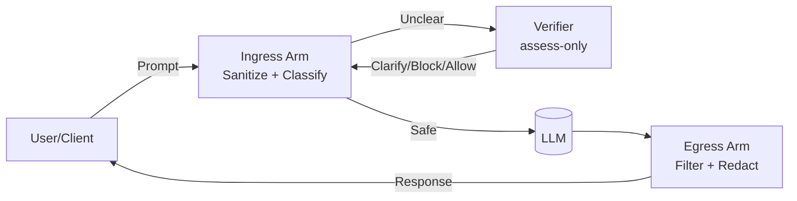

# Guardrail API — Docs Portal



- **What is Guardrail?** A real-time safety & compliance firewall for LLMs with clarify-first policy enforcement.
- **Components**
  - [Core Runtime](components/core.md)
  - [Enterprise Admin Console](components/enterprise.md)
  - [Verifier Microservice](components/verifier.md)
  - [Policy Packs](policy-packs/index.md)

## Clarify-First Architecture (dual-arm)

Ingress isolates inbound threats (prompt injection, confusables) and routes ambiguous intent to Verifier.

Verifier is assess-only (never executes user code); fails closed with provider fallback.

Egress protects outputs (data exfiltration, PHI/PII leaks) even if ingress is degraded (dual-arm decoupling).

---
